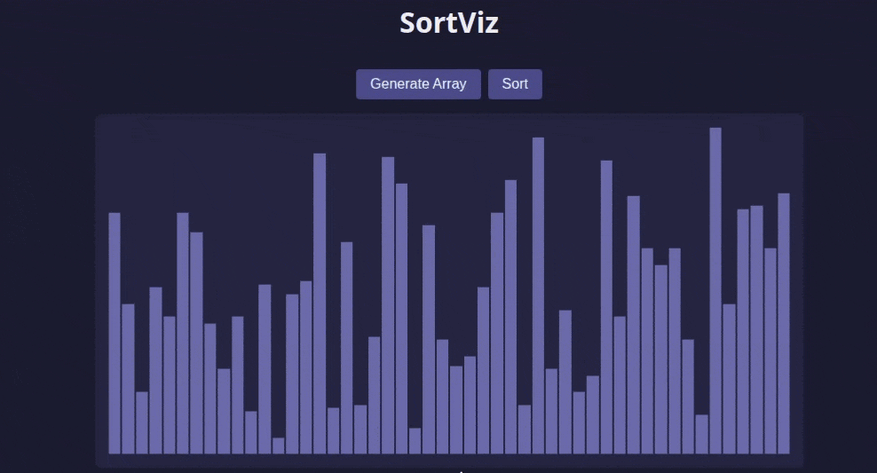

# SortViz

A web application that visualizes sorting algorithms using animated vertical bars.



## Features

- Generate random arrays displayed as bars
- Watch sorting algorithms animate in real-time
- Currently supported algorithms:
  - Bubble Sort

## Requirements

- Bun (https://bun.sh)

## Installation

Clone the repository:

```
git clone git@github.com:hwang-fu/sortviz.git
cd sortviz

Install dependencies:

bun install
```

## Usage

Start the development server:

```
bun src/index.html
```

Open the URL shown in your terminal (usually http://localhost:3000).

Click "Generate Array" to create a new random array, then click "Sort" to watch the sorting animation.

## Tech Stack By Far

- Bun
- TypeScript
- Vanilla HTML/CSS

## License

MIT
